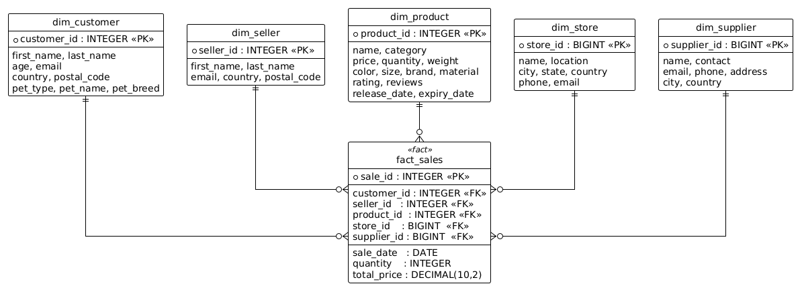
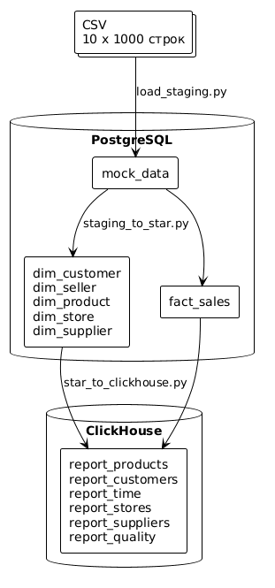

# Лабораторная работа: ETL-конвейер на Apache Spark

Исходные данные - 10 CSV-файлов по 1000 строк, каждая строка полностью денормализована: клиент, продавец, товар, магазин, поставщик и сама продажа в одной записи. Задача - разобрать эту «плоскую» структуру, построить схему звезда в PostgreSQL и вычислить аналитические витрины в ClickHouse через Spark.

## Staging

Все 10 файлов загружаются в одну таблицу `mock_data` с дополнительным полем `file_id`, потому что id в каждом файле идут от 1 до 1000 и без него строки из разных файлов неразличимы. Итог - 10 000 строк сырых данных, все поля TEXT.

## Схема звезда



Это именно звезда, а не снежинка: все пять измерений подключены к `fact_sales` напрямую через внешние ключи, а между собой никак не связаны. Если бы, например, у `dim_store` было поле `country_id`, ссылающееся на отдельную `dim_country`, появилась бы цепочка `fact -> dim_store -> dim_country` - и схема превратилась бы в снежинку. Здесь же справочные атрибуты вроде `country` лежат прямо в измерениях как текст: чуть больше дублирования, зато аналитический запрос обходится одним JOIN на каждое измерение.

Spark строит эти таблицы из staging в одной чёткой последовательности: сначала пять измерений, потом `fact_sales`. Иначе нельзя - PostgreSQL проверяет внешние ключи при вставке, и факт без заполненных измерений не пройдёт. Здесь явно работает идея lazy evaluation в Spark: вся цепочка `.select(...).dropDuplicates(...)` для каждого измерения не выполняется в момент вызова, а только описывает план. Реальное чтение из PostgreSQL и запись обратно происходит только при `.write()`, причём для каждой таблицы Spark пересчитывает план с нуля. Если бы Spark не был ленивым, я не мог бы переиспользовать переменную `raw` шесть раз подряд - данные читались бы из PostgreSQL шесть раз.

Для ключей используется два подхода. Клиент, продавец и товар имеют id в CSV - берём их напрямую как `file_id * 1000 + id`, что даёт уникальные значения от 1 до 10 000. У магазинов и поставщиков своего id нет, поэтому ключ генерируется через `crc32` от всех атрибутов. Это принципиально: когда заполняется `fact_sales`, нужно пересчитать тот же `crc32` из полей staging и получить правильный `store_id` без JOIN по неизвестному ключу.

## Витрины в ClickHouse

Spark читает схему звезда из PostgreSQL и вычисляет 6 агрегированных отчётов, которые записываются в ClickHouse. И вот здесь становится понятно, почему витрины строятся именно из «звезды», а не напрямую из `mock_data`. В staging все справочные поля - TEXT без ограничений: одна и та же страна может встречаться с опечаткой или лишним пробелом. В измерениях же атрибуты прошли приведение типов и `dropDuplicates` один раз при загрузке, и витрины работают с гарантированно чистыми данными. Плюс производительность: `fact_sales` содержит только меры и целочисленные FK, JOIN с `dim_product` - компактная операция, тогда как агрегация из staging означала бы скан всей денормализованной таблицы со всеми 50 текстовыми полями.

ClickHouse в этой связке - не замена PostgreSQL, а его дополнение. PostgreSQL - строчно-ориентированный, удобен для транзакций и FK-проверок при загрузке схемы. ClickHouse - колонно-ориентированный: запрос `SUM(revenue) GROUP BY category` читает с диска только две колонки из всей таблицы, а не строки целиком. На реальных миллионах строк это даёт ускорение в десятки раз. Платой за это стала отсутствующая транзакционность и неэффективность точечных INSERT, поэтому Spark пишет в ClickHouse батчами по 10 000 строк через `mode("append")` - именно так движок MergeTree рассчитан на работу.

## Диаграмма конвейера



## Результаты

Загрузка завершилась без ошибок. Итоговые количества записей:

**PostgreSQL - Star Schema:**

| таблица | строк |
|---|---|
| mock_data | 10 000 |
| fact_sales | 10 000 |
| dim_customer | 10 000 |
| dim_seller | 10 000 |
| dim_product | 10 000 |
| dim_store | 10 000 |
| dim_supplier | 10 000 |

**ClickHouse - витрины:**

| витрина | строк | примечание |
|---|---|---|
| report_products | 9 845 | уникальные комбинации (продукт, категория) |
| report_customers | 10 000 | по одной записи на клиента |
| report_time | 12 | один ряд на каждый месяц 2021 года |
| report_stores | 10 000 | по одной записи на магазин |
| report_suppliers | 10 000 | по одной записи на поставщика |
| report_quality | 10 000 | рейтинг и количество продаж по продукту |

Суммарная выручка за год - 2 529 852.12. Данные охватывают 12 месяцев 2021 года, продажи распределены равномерно: от 739 заказов в феврале до 897 в августе.

Топ-5 клиентов по сумме покупок:

| клиент | страна | потрачено |
|---|---|---|
| Gus Hartshorn | Albania | 499.85 |
| Hayes McKain | Portugal | 499.80 |
| Ava Lomas | China | 499.76 |
| Dawna Impey | Indonesia | 499.76 |
| Lavinia Horsburgh | Poland | 499.73 |

Топ-5 магазинов по выручке:

| магазин | город | страна | выручка |
|---|---|---|---|
| DabZ | Grekan | South Africa | 499.85 |
| Thoughtblab | Fonte | Poland | 499.80 |
| Camido | Longzhong | Sweden | 499.76 |
| Edgeblab | Pesek | Indonesia | 499.76 |
| Centizu | Tylicz | Poland | 499.73 |

## Запуск

```bash
cd BigDataSpark

docker-compose down && docker-compose up -d --build

docker ps --format "table {{.Names}}\t{{.Status}}"

docker exec bigdataspark-spark-1 spark-submit \
  --master local[*] \
  --jars /jars/postgresql-42.7.3.jar \
  /app/load_staging.py

docker exec bigdataspark-spark-1 spark-submit \
  --master local[*] \
  --jars /jars/postgresql-42.7.3.jar \
  /app/staging_to_star.py

docker exec bigdataspark-spark-1 spark-submit \
  --master local[*] \
  --jars /jars/postgresql-42.7.3.jar,/jars/clickhouse-jdbc-0.4.6-all.jar \
  /app/star_to_clickhouse.py
```

Проверка:

```bash
docker exec bigdataspark-postgres-1 psql -U postgres -d petstore -c \
  "SELECT 'fact_sales' AS t, COUNT(*) FROM fact_sales UNION ALL
   SELECT 'dim_customer', COUNT(*) FROM dim_customer UNION ALL
   SELECT 'dim_product',  COUNT(*) FROM dim_product  UNION ALL
   SELECT 'dim_store',    COUNT(*) FROM dim_store     UNION ALL
   SELECT 'dim_supplier', COUNT(*) FROM dim_supplier;"

docker exec bigdataspark-clickhouse-1 clickhouse-client --password clickhouse --query \
  "SELECT 'report_products'  AS t, count() FROM report_products  UNION ALL
   SELECT 'report_customers',       count() FROM report_customers UNION ALL
   SELECT 'report_time',            count() FROM report_time      UNION ALL
   SELECT 'report_stores',          count() FROM report_stores    UNION ALL
   SELECT 'report_suppliers',       count() FROM report_suppliers UNION ALL
   SELECT 'report_quality',         count() FROM report_quality;"
```
